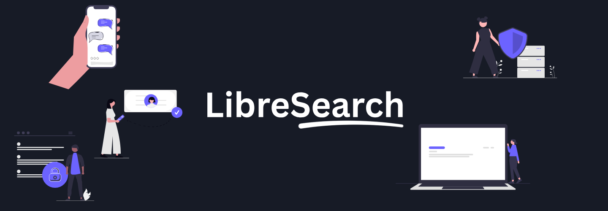

  

# LibreSearch

LibreSearch is a private search engine that gives you real results without tracking who you are, building a profile on you, or selling your attention.

Every search starts fresh. No cookies. No logs. No surveillance.

## Privacy by design

- **No query logging** — searches are never stored on any server
- **No profiling** — your searches are never tied to an identity or sold to advertisers
- **No third-party trackers** — built-in tracker and ad blocking at the network level
- **Local-first settings** — your preferences, history, and theme live entirely in your browser

## What you get

- Web, image, video, and news search
- Instant answers for calculations, conversions, definitions, and quick facts
- Instant knowledge panels for people, places, and things
- Bang shortcuts (`!w`, `!gh`, `!yt`, and hundreds more) for one-tap searches on other sites
- Map view for location queries
- Built-in video viewer that plays results without leaving the page
- Search history that stays on your device and can be cleared at any time
- Tracking parameter stripping on outbound links
- Safe search, region selection, and freshness filters
- Four themes: dark, light, slate, and sand
- Compact results mode for faster scanning
- Full keyboard navigation
- OpenSearch support — set LibreSearch as your browser's default search engine

## Built for the open web

LibreSearch is a private meta-search frontend. Your query is proxied through our server to an independent upstream index, anonymously — the index never sees your IP, cookies, or browser fingerprint.

## Bot protection without surveillance

LibreSearch uses [Altcha](https://altcha.org), a privacy-preserving proof-of-work challenge, to keep automated scrapers out. There are no CAPTCHAs, no behavioral tracking, and no third-party cookies — just a tiny computation your browser solves locally.

## Support the project

LibreSearch is free and ad-free. If you'd like to keep it that way, you can support development on the [donate page](/donate).

## Stay in touch

- 

- 

## License

AGPL — see [LICENSE](LICENSE).
